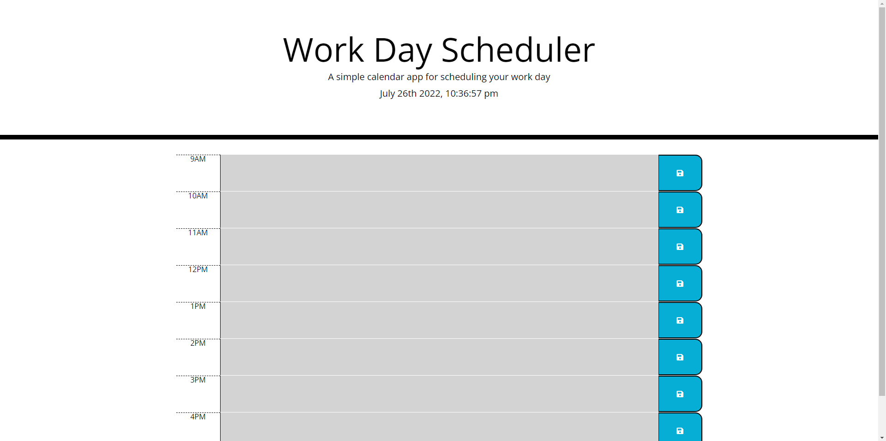

# Daily_planner

# Javascript
Within the JS I have added it so that the date and time show at the top of the page. I have also added it so that the colors of the blocks will change given if its in the past, future, or the present time. Unfortunalty I was unable to get the users input to save to the document. 

# HTML 
I added the blocks given the specific time. I have also added bootstrap styling so that the the blocks and the time fit onto the page. 

# image and depoyed link
The photo shows the working webpage showing all the time slots greyed out since its passed 9-5. 

deployed link: https://jacobschwal.github.io/Daily_planner/